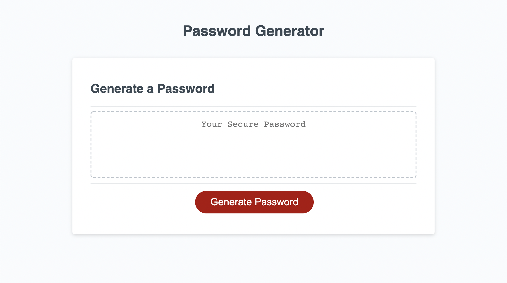
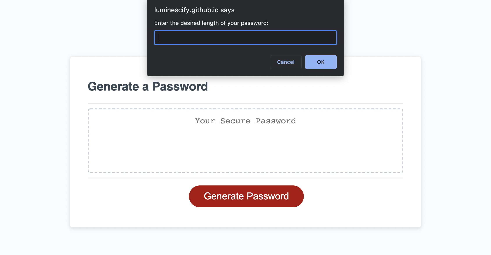
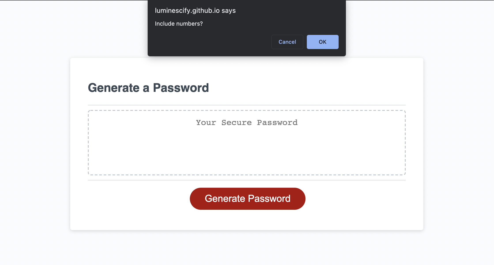
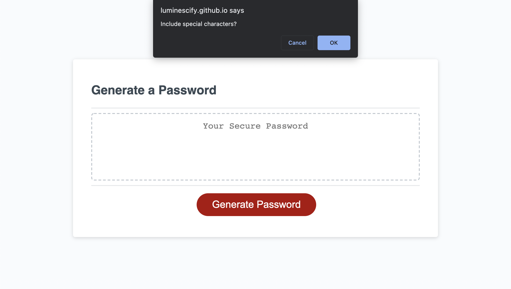
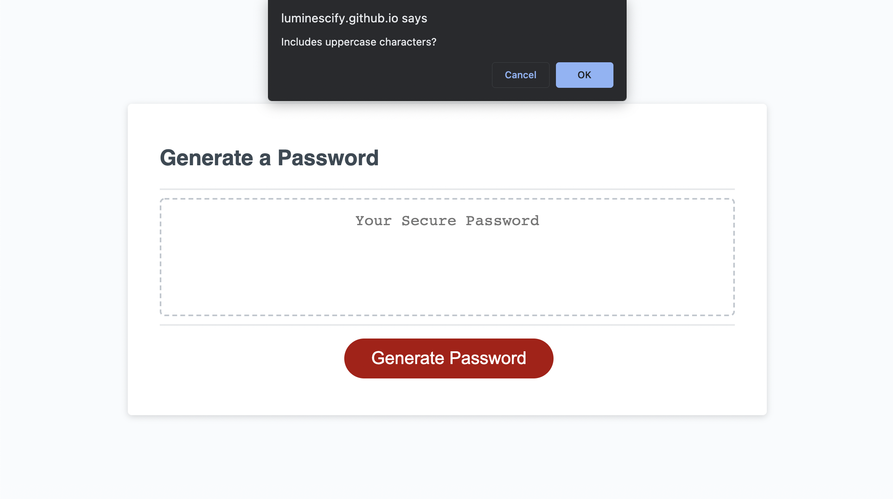
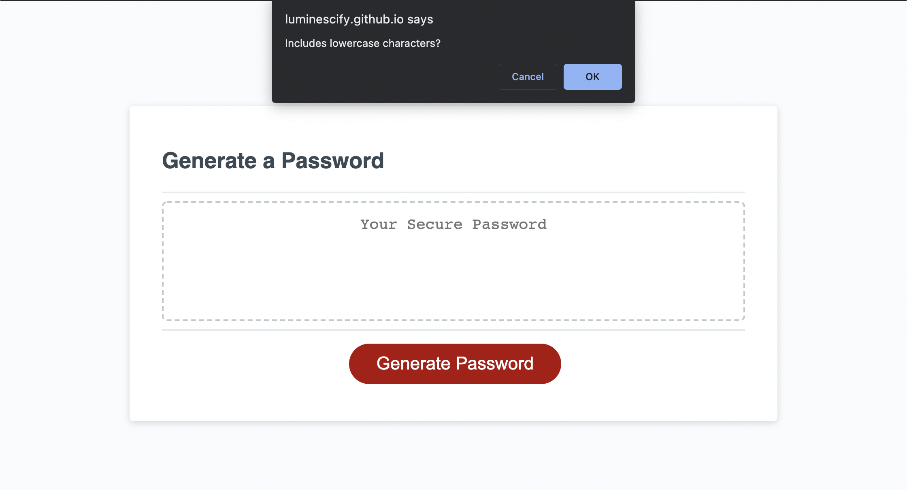
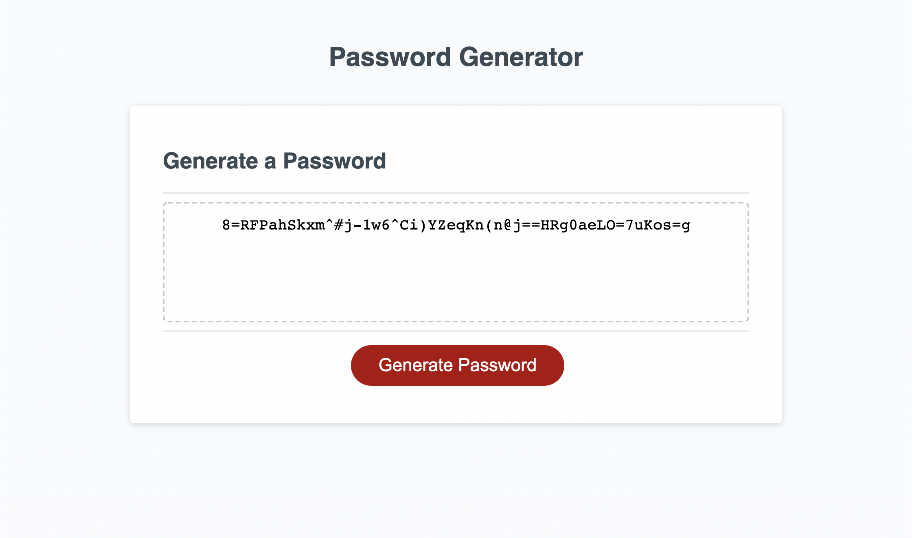

# Password Generator

## Description
A program that allows users to randomly generate a password based on criteria they've selected.

## Usage
To view the live website follow this link: [Password Generator](https://luminescify.github.io/password-generator/)

## Screenshots
The following are screenshots of the live page and a sample of how the user would utilize the generator:

The main page that a user sees upon website opening.

Script prompts user to enter desired length.

Script confirms yes/no include numbers.

Script confirms yes/no include special characters.

Script confirms yes/no include uppercase characters.

Script confirms yes/no include lowercase characters.

Page offers user completely random generated password with user's selected password length.

